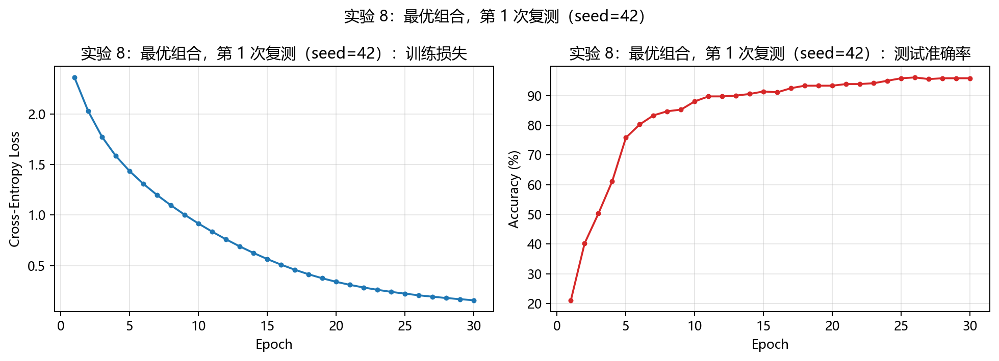

# 01 — MLP Digits Experiment

A reproducible controlled study of a multilayer perceptron (MLP) on scikit-learn's `load_digits` dataset. I implemented the training loop directly in PyTorch and measured how design choices affect convergence and test accuracy.

## Question

Starting from a small Sigmoid MLP trained with full-batch SGD, which individual changes improve optimization on the handwritten-digits classification task, and which combination is most reliable under the fixed protocol?

## Implementation

- Dataset: scikit-learn `load_digits` (1,797 samples; 64 features; 10 classes).
- Split: stratified 80/20 train/test split with seed 42.
- Baseline: `64 → 32 → 10`, Sigmoid, SGD with learning rate 0.1, 30 full-batch epochs.
- Training: PyTorch forward pass, cross-entropy loss, `backward()`, and optimizer updates written explicitly.
- Controls: activation, hidden-layer depth, optimizer, learning rate, L2 regularization, Dropout, and BatchNorm.

`sklearn.neural_network.MLPClassifier` is not used.

## Result summary

| Experiment | Test accuracy | Training time |
| --- | ---: | ---: |
| Baseline: Sigmoid + SGD(0.1) | 22.22% | 0.0404 s |
| ReLU | 47.50% | 0.0400 s |
| 2 × 128 Sigmoid | 7.22% | 0.0792 s |
| Adam(0.01) | 82.22% | 0.0471 s |
| BatchNorm | 79.17% | 0.0553 s |
| Final: ReLU + Adam(0.01) + BatchNorm | **95.83%** | 0.0683 s |

The deep Sigmoid model is deliberately retained as a negative result: its loss stalls near `ln(10)`, illustrating optimization difficulty and vanishing gradients. The final configuration was verified in three runs and reached 95.83% test accuracy each time.



## Layout

```text
01-mlp-digits/
├── notebooks/mlp_digits_experiment.ipynb  # Step-by-step experiment record
├── src/run_experiments.py                  # Standalone reproducible runner
├── results/                                # Curated curves and measured results
└── requirements.txt
```

## Reproduce

```bash
cd labs/01-mlp-digits
python -m venv .venv
# Windows: .venv\Scripts\activate
# Linux/macOS: source .venv/bin/activate
pip install -r requirements.txt
python src/run_experiments.py --output results/reproduced
```

The script uses CPU by default and finishes quickly on this small dataset. CUDA is optional.

## Final configuration

```python
hidden = (32,)
activation = "relu"
optimizer = "adam"
learning_rate = 0.01
batch_norm = True
dropout = 0.0
weight_decay = 0.0
```

## Limitations

The dataset is deliberately small and the results are intended to explain optimization behavior, not to claim state-of-the-art handwriting-recognition performance. The final configuration is evaluated under a fixed split; a broader claim would require cross-validation or additional datasets.
