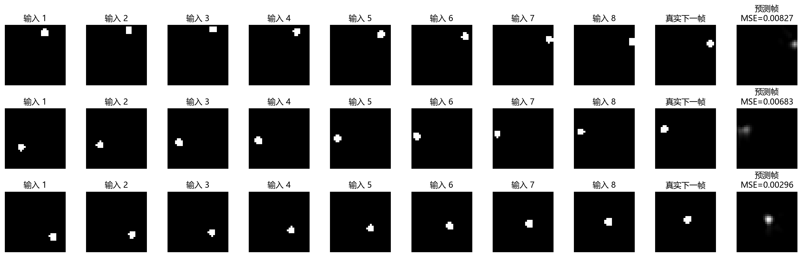

# 02 — ConvLSTM Bouncing Balls

A controlled PyTorch study of ConvLSTM for one-step prediction in a synthetic spatiotemporal sequence. A model observes several 32 × 32 frames of a bouncing ball and predicts the next frame.

## Question

How do depth, hidden channels, convolutional receptive field, input history, network structure, and training loss affect next-frame prediction quality?

## Protocol

- Data: 2,000 independently generated training sequences and 200 independent test sequences; each sequence has 10 binary 32 × 32 frames.
- Motion: one radius-2 ball with random initial position, speed 0.8–1.6 pixels per frame, and elastic boundary reflection.
- Baseline: one ConvLSTM layer, 32 hidden channels, 3 × 3 kernel, four input frames, MSE loss, Adam (`lr=0.001`), batch size 64, and five epochs.
- Evaluation: test MSE, test MAE, elapsed training time, and qualitative frame comparisons. Every controlled experiment changes only one factor.

## Results

| Experiment | Test MSE | Test MAE | Time (s) |
| --- | ---: | ---: | ---: |
| Baseline | 0.006012 | 0.016014 | 2.52 |
| 2 ConvLSTM layers | 0.005010 | 0.015712 | 4.52 |
| 64 hidden channels | 0.004986 | 0.013552 | 5.33 |
| 5 × 5 kernel | 0.004582 | 0.016113 | 3.62 |
| 8 input frames | 0.005867 | 0.016854 | 4.05 |
| Flattened fully connected LSTM | 0.009378 | 0.033668 | 0.19 |
| L1 loss | 0.012110 | 0.013698 | 2.35 |
| Best combination, 3-run mean | **0.003967** | **0.013369** | 29.82 |

The best configuration combines two ConvLSTM layers, 64 hidden channels, a 5 × 5 kernel, and eight input frames. It was checked with seeds 42, 43, and 44. The flattened LSTM is retained as a negative result: despite far more parameters, it loses local spatial structure and has worse prediction error.



## Layout

```text
02-convlstm-bouncing-balls/
├── src/run_experiments.py       # standalone runner for all controlled trials
├── results/                     # curated figures and measured tables
├── requirements.txt
├── requirements-verified.txt
└── ENVIRONMENT.md
```

## Reproduce

```bash
cd labs/02-convlstm-bouncing-balls
python -m venv .venv
# Windows: .venv\Scripts\activate
# Linux/macOS: source .venv/bin/activate
pip install -r requirements.txt
python src/run_experiments.py --output results/reproduced
```

Pass `--quick` to validate the pipeline with fewer sequences and epochs. The default run uses the full protocol. Generated checkpoints and reproduction outputs are intentionally excluded from version control.

## Limitations

The dataset has one clean object and deterministic physics. It is useful for isolating architectural effects, but it does not represent the object appearance changes, noise, multi-scale dynamics, and uncertainty of real video or radar-nowcasting tasks.
