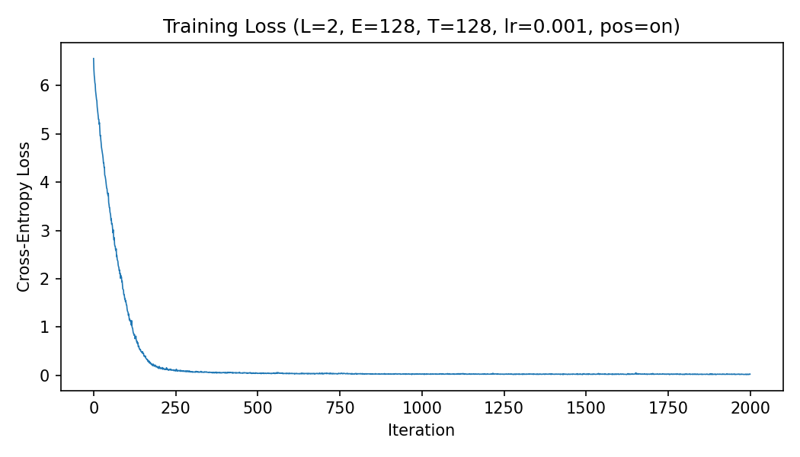

# 03 — Minimal Character GPT on CPU

## 课程实验三查看入口

本目录是“手搓最小 LLM：使用 CPU 训练字符级 GPT”的完整实验材料。建议按下面的顺序查看：

1. **[打开完整实验 Notebook](experiment_record.ipynb)**：主要实验记录，包含代码阅读、环境检查、基线训练、控制变量实验、采样实验、真实运行输出和结果分析。
2. **[查看核心实现 `min_llm.py`](min_llm.py)**：单文件实现字符级分词器、因果自注意力、Transformer、训练流程和文本采样。
3. **[查看实验结果汇总](results/experiment_results.csv)**：集中列出各组配置、参数量、最终 loss 和训练时间。

Notebook 是本实验的主要查看入口，所有正式实验均已运行，输出和曲线保留在文件中。`results/` 同时提供原始 loss 数据、训练曲线和部分生成文本，便于核对结论。

---

A compact, single-file implementation of a decoder-only Transformer trained from scratch on a small Chinese classical-poetry corpus. The experiment focuses on the mechanics of causal self-attention, residual Transformer blocks, next-character prediction, and autoregressive sampling.

## Question

How do learning rate, Transformer depth, embedding width, context length, positional encoding, and sampling settings affect a roughly 0.5M-parameter character language model trained on CPU?

## Implementation

- Tokenization: one Unicode character per token, with a vocabulary learned from the built-in corpus.
- Baseline: 2 layers, 4 heads, embedding width 128, context length 128, batch size 32, AdamW at `1e-3`, and seed 42.
- Architecture: token and position embeddings, pre-norm causal self-attention, residual MLP blocks, final layer normalization, and tied input/output weights.
- Training: explicit random batch construction, forward pass, cross-entropy loss, backpropagation, optimizer step, artifact saving, and autoregressive generation.
- Sampling: temperature, top-k filtering, and an optional no-repeat n-gram constraint.

The implementation uses PyTorch tensor operations and modules, but does not use a packaged GPT or Transformer model.

## Measured results

All controlled comparisons below use 1,000 updates and change one target factor from the common reference. The separate baseline uses 2,000 updates.

| Run | Parameters | Final training loss | Time (s) |
| --- | ---: | ---: | ---: |
| 2,000-step baseline | 502,656 | 0.0258 | 103.60 |
| 1,000-step reference | 502,656 | 0.0232 | 51.63 |
| Learning rate `1e-2` | 502,656 | 0.0413 | 89.52 |
| Learning rate `1e-4` | 502,656 | 0.6896 | 52.43 |
| 1 layer | 304,384 | 0.0265 | 30.26 |
| 4 layers | 899,200 | 0.0242 | 93.59 |
| Embedding width 64 | 153,024 | 0.0548 | 29.18 |
| Embedding width 256 | 1,791,744 | 0.0219 | 111.02 |
| Context length 32 | 490,368 | 0.0957 | 23.49 |
| No position embedding | 486,272 | 0.0265 | 51.43 |

The low training losses should be interpreted carefully. The corpus contains only 2,163 characters, and the baseline generated text contains long verbatim spans from that corpus. Increasing capacity mainly improves memorization under this setup. Removing positional embeddings still permits low training loss, while generated ordering becomes less coherent. With the trained distribution already very sharp, temperature `0.5` versus `1.0` and top-k `5` versus `20` produced almost identical fixed-seed samples; temperature `1.5` changed the output more visibly and reduced coherence.



## Layout

```text
03-min-llm/
├── min_llm.py                  # complete model, training, and sampling pipeline
├── experiment_record.ipynb     # executed step-by-step experiment record
├── results/
│   ├── experiment_results.csv  # consolidated measured metrics
│   ├── loss_curve_*.png        # measured learning curves
│   ├── losses_*.csv            # raw per-step training losses
│   └── samples/                # selected generated text
├── requirements.txt
└── ENVIRONMENT.md
```

## Reproduce

```bash
cd labs/03-min-llm
python -m venv .venv
# Windows: .venv\Scripts\activate
# Linux/macOS: source .venv/bin/activate
pip install -r requirements.txt

# Fast pipeline check
python min_llm.py --iters 5 --skip_generation --output_dir results/smoke

# Full baseline; saves a checkpoint for later sampling
python min_llm.py --save_checkpoint --output_dir results/reproduced
```

To sample again from the reproduced checkpoint:

```bash
python min_llm.py --sample_only \
  --checkpoint results/reproduced/checkpoint_L2_E128_lr0.001.pt \
  --temperature 1.0 --top_k 20 \
  --output_dir results/reproduced/sampling
```

The executed notebook contains the exact commands used for the controlled runs. Output directories for smoke tests and reproductions are excluded from version control.

## Limitations

This is a didactic small-data experiment with no held-out language-model evaluation. Training loss and visually plausible samples do not demonstrate general language ability. The built-in corpus is narrow, the model overfits it, timing depends on CPU and thread settings, and fixed-seed sampling comparisons cover only a few prompts.
